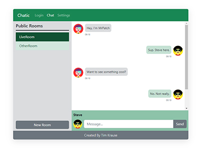

# Chatic

Chatic is an online chat room that utilizes Socket.IO for real-time communication.

## Demo

https://chatic.timkrause.dev/

## Features

- **Users**: Choose from existing users or create a new account with a custom avatar
- **Live Chat**: Socket.IO was integrated to enable websockets and provide live chat and other features
- **Messages**: Manage messages with the ability to send, receive, edit, and delete
- **Chat History**: Your messages are securely stored in a MongoDB database, ensuring their availability upon your return
- **Notifications**: Stay informed with notifications when a message is received in another room

## Tech Stack

**Client:** React, Boostrap, SCSS
**Server:** Node, Express
**Database:** MongoDB
**Other:** Socket.IO
## Contact
If you have any questions about my work or if you have any opportunities you think I would be a good fit for, please [contact me](mailto:timkrausedev@gmail.com).
